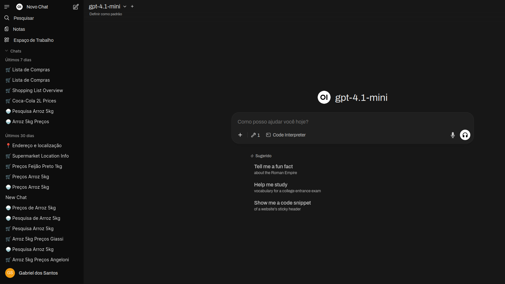

# Giassi MCP - Supermarket Price Comparison Tool

A Model Context Protocol (MCP) server that enables AI assistants to search and compare product prices between Giassi and Angeloni supermarkets in Brazil. This tool integrates seamlessly with Open WebUI to provide real-time price comparisons and shopping list management.

## Features

- **Product Search**: Search for products across both Giassi and Angeloni supermarket websites simultaneously
- **Price Comparison**: Get real-time pricing information from both stores in a formatted, easy-to-compare layout
- **Shopping List Management**: Add, remove, and update products in your shopping list with quantities and prices
- **Store Location Finder**: Find the closest supermarket locations based on your address
- **Price Calculator**: Calculate total shopping costs grouped by supermarket

## Available Tools

- **search_products(search_term)** - Search for products on both supermarket websites
- **add_to_list(unidades, product_name, store, price)** - Add products to your shopping list
- **view_list()** - View all products in your shopping list
- **remove_from_list(product_name)** - Remove products from your shopping list
- **update_unidades(product_name, new_unidades)** - Update product quantities
- **find_nearest_supermarket(address)** - Find closest supermarket locations
- **calculate_shopping_totals()** - Calculate total costs by store

## Usage with Open WebUI

This MCP server is designed to work with Open WebUI, providing a chat-based interface for grocery shopping and price comparison. Users can interact naturally with the AI assistant to search for products, manage shopping lists, and find the best deals across different supermarkets.

## Project Structure

- **/giassi/** - Giassi supermarket scraper implementation
- **/angeloni/** - Angeloni supermarket scraper implementation
- **/utils/** - Utility functions for formatting, calculations, and distance finding
- **/config_loader/** - Configuration management for scrapers
- **main.py** - Main MCP server implementation with all available tools
